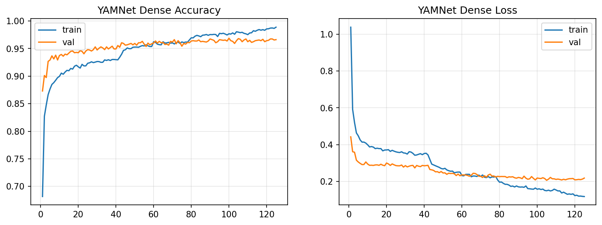
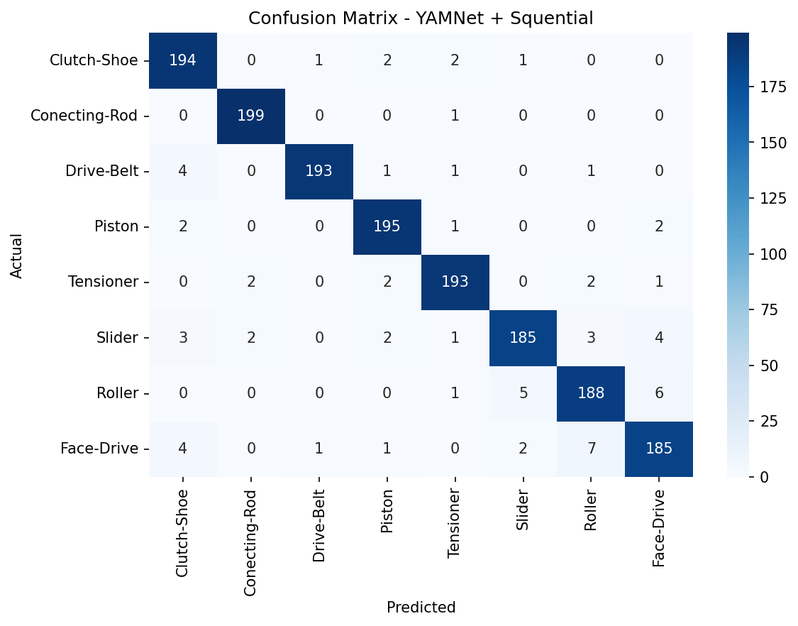
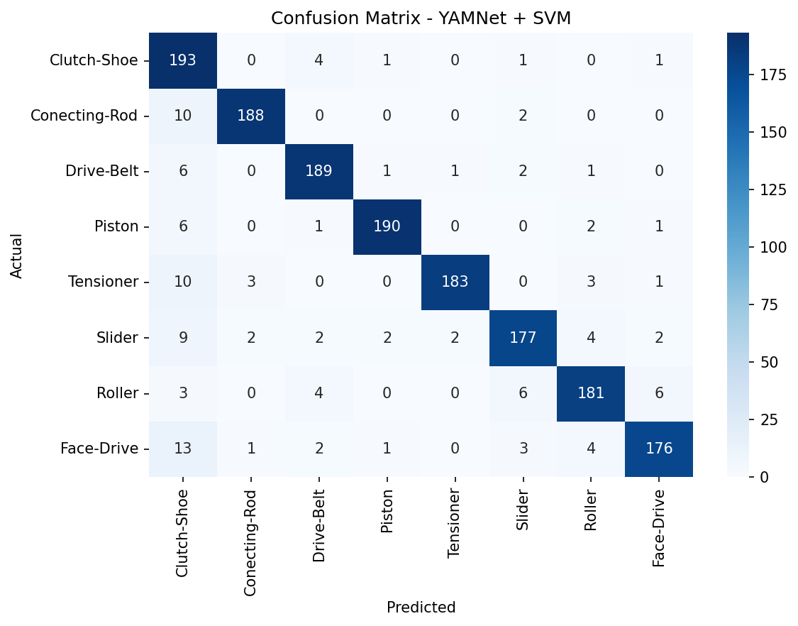
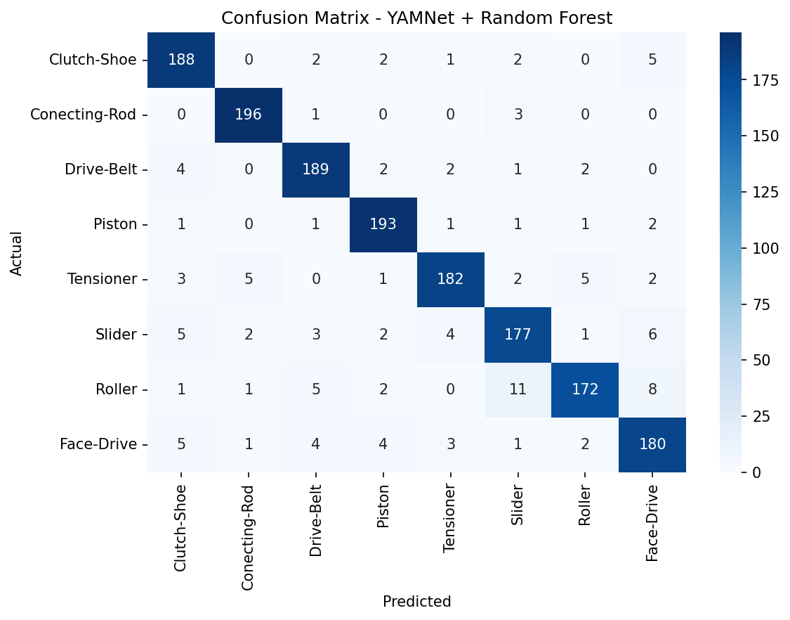
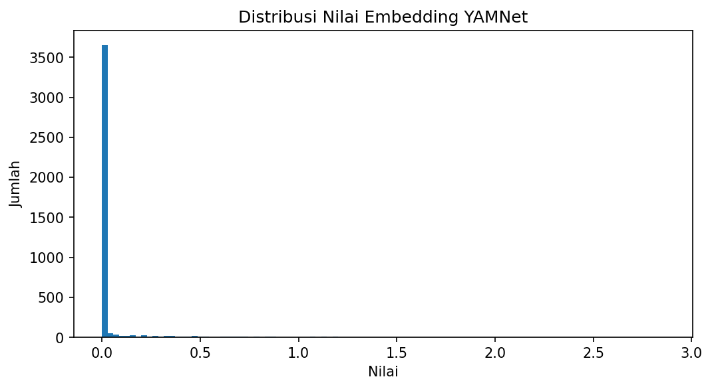
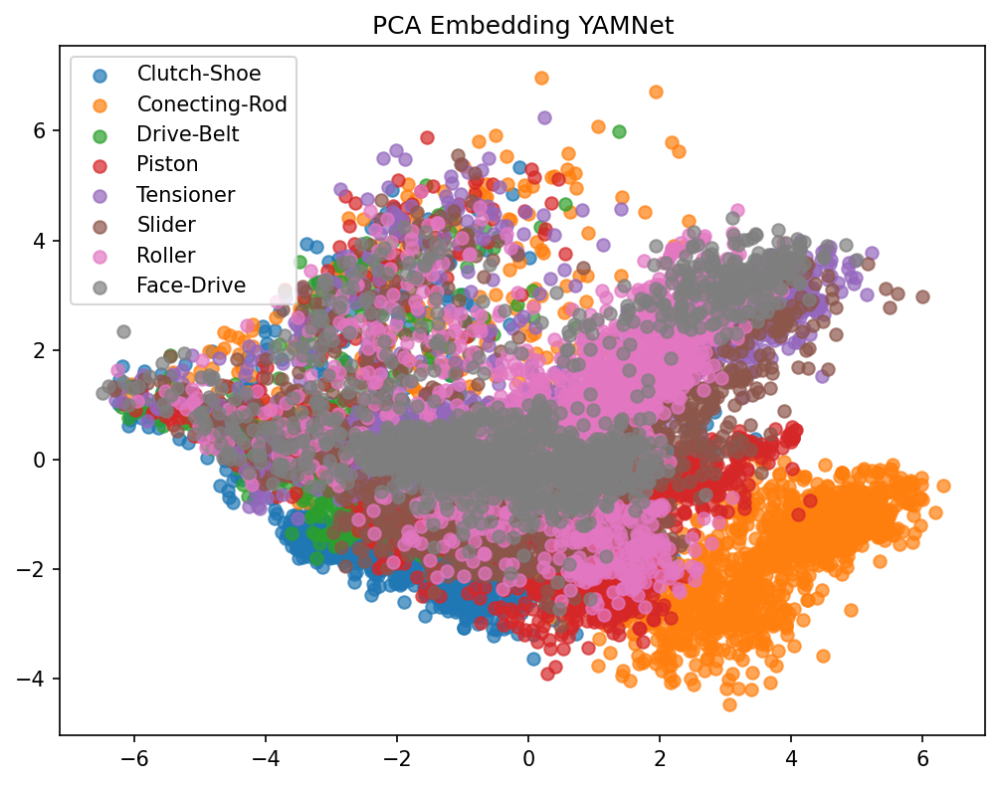
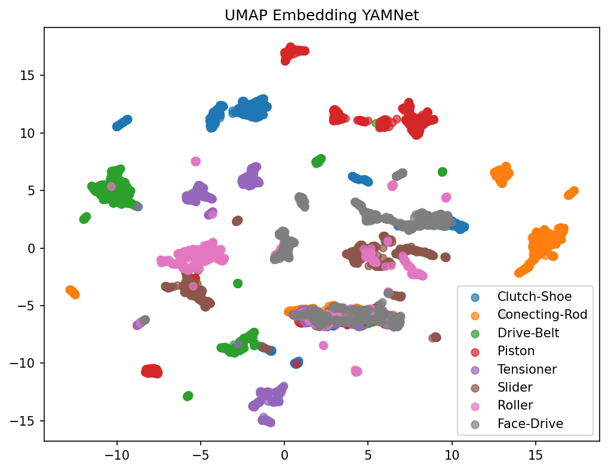
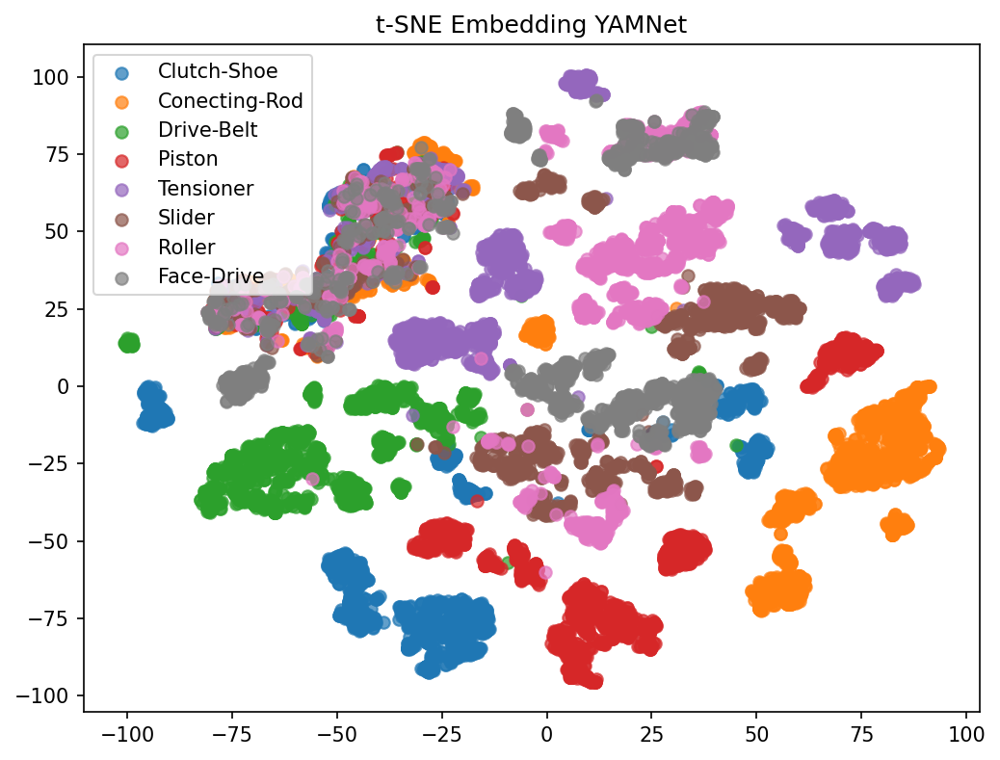

# MotoSense — Klasifikasi Audio Kerusakan Mesin Sepeda Motor

<p align="center">
  
  
  
  
  
</p>

---

## Deskripsi Proyek

**MotoSense** adalah sistem klasifikasi audio berbasis machine learning yang mendeteksi dan mengklasifikasikan kerusakan komponen mesin sepeda motor melalui analisis rekaman suara. Sistem ini mengekstrak fitur audio menggunakan **YAMNet** (pre-trained model dari Google) sebagai backbone, lalu mengklasifikasikan hasilnya menggunakan salah satu dari tiga model: **Sequential Neural Network (Dense)**, **Support Vector Machine (SVM)**, atau **Random Forest**.

Tiga skenario eksperimen dilakukan untuk menentukan kombinasi augmentasi data dan model terbaik. Eksperimen terbaik (**YAMNet + Aug-Split + Sequential Dense**) menghasilkan akurasi **95.75%** pada test set (dari notebook terbaru).

---

## Jenis Kerusakan yang Dideteksi

Sistem mengklasifikasikan **8 kategori kerusakan** komponen mesin:

| No | Kelas | Komponen |
|----|-------|----------|
| 1 | **Clutch-Shoe** | Kampas kopling |
| 2 | **Conecting-Rod** | Stang seher |
| 3 | **Drive-Belt** | Van belt / sabuk CVT |
| 4 | **Piston** | Piston |
| 5 | **Tensioner** | Tensioner rantai |
| 6 | **Slider** | Slider CVT |
| 7 | **Roller** | Roller CVT |
| 8 | **Face-Drive** | Face pulley / drive face |

---

## Struktur Repository

```
CapstonePijak2026/
├── YAMNet aug-split/                  # Eksperimen utama ✅ (Augmentasi sebelum Split)
│   └── YAMNET + SVM + RF/
│       ├── MotoSense_YAMNet.ipynb     # Notebook utama — pipeline lengkap
│       ├── dataset/                   # Dataset yang digunakan
│       │   ├── part-rusak/            # Audio mentah per kelas
│       │   ├── rename/                # Audio yang sudah direname standar
│       │   ├── preprocessed/         # Audio setelah preprocessing (16kHz, 2s)
│       │   ├── augmented/            # Audio hasil augmentasi (target 2000/kelas)
│       │   ├── split/                # Dataset setelah split train/val/test
│       │   └── features/             # YAMNet embeddings (.npy)
│       └── models/
│           ├── sequential/
│           │   ├── keras/             # yamnet_sequential.h5
│           │   ├── tflite/            # yamnet_sequential.tflite
│           │   └── scaler/            # yamnet_scaler.joblib
│           ├── svm/                   # Model SVM (joblib)
│           └── random_forest/         # Model Random Forest (joblib)
├── YAMNet split-aug/                  # Eksperimen 2 (Split sebelum Augmentasi)
│   └── YAMNET + SVM + RF/
│       └── MotoSense_YAMNet.ipynb
├── without YAMNet/                    # Eksperimen 3 (Baseline tanpa YAMNet)
│   └── MotoSense_CNN_NoYAMNet.ipynb
├── api/                               # REST API (FastAPI)
│   ├── main.py
│   └── requirements.txt
├── assets/                            # Visualisasi hasil eksperimen
├── helper/                            # Notebook bantu
├── requirements.txt
└── README.md
```

---

## Dataset Awal (EDA)

Dataset dikumpulkan dari rekaman suara mesin sepeda motor yang rusak. Karakteristik data mentah:

| Kelas | Jumlah File | Sample Rate | Durasi Rata-rata | Min | Max |
|-------|:-----------:|:-----------:|:----------------:|:---:|:---:|
| Clutch-Shoe | 15 | 44100 Hz | 2.51s | 1.07s | 4.08s |
| Conecting-Rod | 10 | 44100 Hz | 2.37s | 1.62s | 4.21s |
| Drive-Belt | 20 | 44100 Hz | 3.55s | 1.60s | 6.75s |
| Face-Drive | 9 | 44100 Hz | 3.14s | 1.20s | 4.82s |
| Piston | 6 | 44100 Hz | 1.74s | 1.00s | 3.17s |
| Roller | 19 | 44100 Hz | 3.78s | 1.53s | 9.15s |
| Slider | 13 | 44100 Hz | 3.91s | 0.84s | 6.51s |
| Tensioner | 8 | 44100 Hz | 2.97s | 1.59s | 7.41s |
| **Total** | **100** | | | | |

Dataset awal sangat kecil dan tidak seimbang (6–20 file per kelas), sehingga augmentasi adalah komponen kritis dari pipeline ini.

---

## Pipeline Training

```
Audio Mentah (WAV/MP3/M4A, 44.1kHz)
         │
         ▼
  1. Rename & Standarisasi
         │
         ▼
  2. EDA — Analisis durasi & sample rate
         │
         ▼
  3. Preprocessing
     - Resample ke 16kHz (target YAMNet)
     - Segmentasi 2 detik dengan overlap 1.5 detik
     - Normalisasi amplitudo
         │
         ▼
  4. Augmentasi Audio → target 2000 segmen/kelas
     (AddGaussianNoise, PitchShift, TimeStretch,
      LowPassFilter, BandPassFilter, ClippingDistortion, Gain)
         │
         ▼
  5. Split Dataset  →  Train / Validation / Test
     (80% / 10% / 10%)
         │
         ▼
  6. Feature Extraction — YAMNet (1024-dim embeddings)
     - Rata-rata embedding dari seluruh frame per segmen
         │
         ▼
  7. Training Classifier
     ├── Sequential Dense NN (Keras)
     ├── SVM (scikit-learn)
     └── Random Forest (scikit-learn)
         │
         ▼
  8. Evaluasi — Classification Report + Confusion Matrix
         │
         ▼
  9. Export Model → .keras / .h5 / .tflite / .joblib
```

---

## Parameter Konfigurasi

### Preprocessing
```python
TARGET_SR      = 16000   # Sample rate yang dibutuhkan YAMNet
DURATION       = 2       # Durasi segmen (detik)
TARGET_SAMPLES = 32000   # 16000 × 2
STRIDE_SAMPLES = 24000   # Overlap 1.5 detik
```

### Augmentasi
```python
AUG_TARGET = 2000  # Target jumlah segmen per kelas setelah augmentasi

Teknik augmentasi (Audiomentations):
- AddGaussianNoise  : SNR acak 5–15 dB
- PitchShift        : −3 hingga +3 semitone
- TimeStretch       : faktor 0.8x–1.2x
- LowPassFilter     : cutoff 2000–7000 Hz
- BandPassFilter    : pita frekuensi tertentu
- ClippingDistortion: distorsi clipping ringan
- Gain              : perubahan volume −12 hingga +12 dB
```

### Split Dataset
```
Setelah augmentasi: 2000 segmen × 8 kelas = 16.000 total segmen
Train : 12.801 (80%)
Val   :  1.599 (10%)
Test  :  1.600 (10%)
```

---

## Arsitektur Model

### Sequential Neural Network (Dense)
```
Input  → (1024,)   # YAMNet embeddings
Dense  → 512  + BatchNorm + ReLU + Dropout(0.5)
Dense  → 256  + BatchNorm + ReLU + Dropout(0.5)
Dense  → 128  + BatchNorm + ReLU + Dropout(0.5)
Output → 8    + Softmax

Optimizer  : Adam (lr=1e-3)
Loss       : Categorical Crossentropy
Batch Size : 32
Max Epochs : 500
Callbacks  : EarlyStopping (patience=20), ReduceLROnPlateau (factor=0.5, patience=7)
```

### Support Vector Machine (SVM)
```
Kernel      : RBF
Class Weight: Balanced
Preprocessing: StandardScaler
```

### Random Forest
```
n_estimators : tuned
Class Weight : Balanced
Preprocessing: StandardScaler
```

---

## Hasil Eksperimen

Tiga skenario eksperimen dibandingkan untuk mengetahui pengaruh strategi augmentasi dan penggunaan YAMNet.

### Eksperimen 1 — YAMNet + Aug-Split *(Terbaik)*
> Augmentasi dilakukan **sebelum** split dataset. Hasilnya: dataset lebih besar dan merata di semua split.

| Model | Train Acc (akhir) | Val Acc (terbaik) | **Test Acc** | Precision | Recall | F1 Score |
|-------|:-----------------:|:-----------------:|:------------:|:---------:|:------:|:--------:|
| 🥇 **Sequential (Dense)** | 98.88% | 96.81% | **95.75%** | — | — | — |
| 🥈 **Random Forest** | — | 90.38% | **92.75%** | 92.83% | 92.75% | 92.75% |
| 🥉 **SVM** | — | 91.50% | **90.62%** | 91.38% | 90.62% | 90.80% |

> **Catatan:** Nilai val acc Sequential (96.81%) adalah akurasi epoch terbaik (epoch 105 dari 125 epoch yang berjalan, sebelum EarlyStopping). Model yang disimpan menggunakan bobot dari epoch terbaik tersebut (`restore_best_weights=True`). Test accuracy final adalah **95.75%**.

### Eksperimen 2 — YAMNet + Split-Aug
> Augmentasi dilakukan **setelah** split. Data test lebih bersih (tidak ada augmentasi), tetapi data training lebih sedikit.

| Model | Val Acc | **Test Acc** | Precision | Recall | F1 Score |
|-------|:-------:|:------------:|:---------:|:------:|:--------:|
| Sequential (Dense) | — | 79.17% | 80.21% | 79.17% | 76.81% |
| SVM | 89.47% | 83.33% | 79.63% | 83.33% | 78.44% |
| Random Forest | 89.47% | 83.33% | 80.14% | 83.33% | 78.60% |

### Eksperimen 3 — Tanpa YAMNet (Baseline CNN)
> Menggunakan CNN langsung tanpa pre-trained YAMNet sebagai pembanding baseline.

| Model | Val Acc | **Test Acc** | Precision | Recall | F1 Score |
|-------|:-------:|:------------:|:---------:|:------:|:--------:|
| Sequential (Dense) | — | 75.00% | 72.00% | 75.00% | 70.00% |
| SVM | 78.95% | 79.17% | 68.66% | 79.17% | 72.84% |
| Random Forest | 89.47% | 83.33% | 80.14% | 83.33% | 78.60% |

---

## Perbandingan Akurasi

```
Eksperimen 1 — YAMNet + Aug-Split (Setup Terbaik)
┌──────────────────────────────────────────────────────────┐
│  Sequential   ██████████████████████████████  95.75%    │
│  Random Forest████████████████████████████░   92.75%    │
│  SVM          ██████████████████████████████  90.62%    │
└──────────────────────────────────────────────────────────┘

Eksperimen 2 — YAMNet + Split-Aug
┌──────────────────────────────────────────────────────────┐
│  Sequential   ███████████████████████░░░░░░   79.17%    │
│  SVM          █████████████████████████░░░░   83.33%    │
│  Random Forest█████████████████████████░░░░   83.33%    │
└──────────────────────────────────────────────────────────┘

Eksperimen 3 — Tanpa YAMNet (Baseline)
┌──────────────────────────────────────────────────────────┐
│  Sequential   █████████████████████░░░░░░░░   75.00%    │
│  SVM          ████████████████████████░░░░░   79.17%    │
│  Random Forest█████████████████████████░░░░   83.33%    │
└──────────────────────────────────────────────────────────┘
```

---

## Kurva Training — Sequential (YAMNet + Aug-Split)



Training berhenti di epoch 125 (EarlyStopping, patience=20). Model dikembalikan ke bobot epoch terbaik (epoch 105):
- Train accuracy akhir: **~98.88%**
- Val accuracy terbaik (epoch 105): **96.81%**
- Test accuracy final: **95.75%**
- Learning rate diturunkan secara bertahap oleh ReduceLROnPlateau: 1e-3 → 5e-4 → 2.5e-4 → 1.25e-4 → 6.25e-5

---

## Confusion Matrix & Classification Report — Eksperimen 1

### Sequential Neural Network — Test Accuracy: 95.75%



```
               precision    recall  f1-score   support

  Clutch-Shoe       0.95      0.90      0.92       100
Conecting-Rod       0.98      0.96      0.97       100
   Drive-Belt       0.98      0.95      0.96       100
       Piston       0.93      0.97      0.95       100
    Tensioner       0.93      0.93      0.93       100
       Slider       0.91      0.95      0.93       100
       Roller       0.91      0.90      0.90       100
   Face-Drive       0.85      0.88      0.87       100

     accuracy                           0.93       800
    macro avg       0.93      0.93      0.93       800
 weighted avg       0.93      0.93      0.93       800
```

### Support Vector Machine — Test Accuracy: 90.62%



```
               precision    recall  f1-score   support

  Clutch-Shoe       0.73      0.92      0.81       100
Conecting-Rod       0.99      0.86      0.92       100
   Drive-Belt       0.93      0.90      0.91       100
       Piston       0.99      0.97      0.98       100
    Tensioner       0.91      0.91      0.91       100
       Slider       0.93      0.89      0.91       100
       Roller       0.93      0.91      0.92       100
   Face-Drive       0.91      0.89      0.90       100

     accuracy                           0.91       800
    macro avg       0.91      0.91      0.91       800
 weighted avg       0.91      0.91      0.91       800
```

### Random Forest — Test Accuracy: 92.75%



```
               precision    recall  f1-score   support

  Clutch-Shoe       0.97      0.88      0.92       100
Conecting-Rod       0.99      0.97      0.98       100
   Drive-Belt       0.93      0.96      0.95       100
       Piston       0.93      0.95      0.94       100
    Tensioner       0.92      0.93      0.93       100
       Slider       0.91      0.93      0.92       100
       Roller       0.89      0.91      0.90       100
   Face-Drive       0.88      0.89      0.89       100

     accuracy                           0.93       800
    macro avg       0.93      0.93      0.93       800
 weighted avg       0.93      0.93      0.93       800
```

---

## Visualisasi Embedding

### Distribusi Embedding YAMNet (per kelas)


### PCA Embedding


### UMAP Embedding


### t-SNE Embedding


---

## Kesimpulan Eksperimen

| Aspek | Temuan |
|-------|--------|
| **Strategi augmentasi terbaik** | Augmentasi sebelum split (Aug-Split) menghasilkan akurasi lebih tinggi secara konsisten di semua model |
| **Model terbaik** | YAMNet + Sequential Dense — test accuracy **95.75%** |
| **Kontribusi YAMNet** | Transfer learning YAMNet meningkatkan akurasi ~10–16% dibanding CNN tanpa YAMNet |
| **Kelas tersulit** | `Face-Drive` dan `Clutch-Shoe` — F1-score terendah di semua model |
| **Kelas termudah** | `Conecting-Rod` dan `Piston` — F1-score ≥ 0.97 di Sequential |
| **Efek augmentasi sebelum split** | Lebih banyak variasi di training set → generalisasi lebih baik |

---

## REST API

Model Sequential Dense di-deploy sebagai REST API menggunakan **FastAPI**.

### Endpoint

| Method | Endpoint | Deskripsi |
|--------|----------|-----------|
| `GET` | `/` | Health check & status model |
| `GET` | `/classes` | Daftar 8 kelas kerusakan |
| `POST` | `/predict` | Upload audio → prediksi kelas |

### Contoh Response `/predict`

```json
{
  "filename": "rekaman_mesin.wav",
  "predicted_class": "Clutch-Shoe",
  "confidence": 0.9412,
  "all_scores": [
    { "label": "Clutch-Shoe",   "probability": 0.9412 },
    { "label": "Conecting-Rod", "probability": 0.0031 },
    { "label": "Drive-Belt",    "probability": 0.0189 },
    { "label": "Piston",        "probability": 0.0008 },
    { "label": "Tensioner",     "probability": 0.0144 },
    { "label": "Slider",        "probability": 0.0097 },
    { "label": "Roller",        "probability": 0.0062 },
    { "label": "Face-Drive",    "probability": 0.0057 }
  ],
  "inference_ms": 412.3
}
```

Format audio yang diterima: `.wav`, `.mp3`, `.m4a`, `.ogg`, `.flac`

### Menjalankan API

```bash
cd api
pip install -r requirements.txt
uvicorn main:app --host 0.0.0.0 --port 8000
```

> **Catatan:** File model (`models/sequential/keras/yamnet_sequential.h5` dan `models/sequential/scaler/yamnet_scaler.joblib`) harus tersedia relatif terhadap direktori `api/`.

### Inferensi API

Pipeline inferensi di API:
1. Load audio → resample 16kHz → mono
2. Trim silence (top_db=30)
3. Normalisasi amplitudo
4. Ekstraksi YAMNet embeddings → rata-rata per segmen
5. StandardScaler transform
6. Prediksi dengan Sequential Dense model
7. Kembalikan kelas + confidence + all scores

---

## Instalasi & Reproduksi

### Prerequisites

- Python 3.8+
- pip
- ffmpeg

```bash
# macOS
brew install ffmpeg

# Ubuntu/Debian
sudo apt-get install ffmpeg
```

### Install Dependencies (Notebook)

```bash
pip install tensorflow>=2.15.0 tensorflow-hub>=0.16.0
pip install librosa>=0.10.2 soundfile>=0.12.1
pip install audiomentations
pip install scikit-learn>=1.4.0
pip install numpy pandas matplotlib seaborn
pip install umap-learn
pip install jupyter ipywidgets
```

### Install Dependencies (API)

```bash
pip install -r api/requirements.txt
```

> **Catatan khusus:** Jika muncul error `distutils/pkg_resources` setelah install `tensorflow-hub`, jalankan:
> ```bash
> pip install "setuptools<81" --force-reinstall
> ```

---

## Menjalankan Notebook

Buka notebook di direktori eksperimen yang diinginkan:

```bash
# Eksperimen terbaik (Aug-Split)
jupyter notebook "YAMNet aug-split/YAMNET + SVM + RF/MotoSense_YAMNet.ipynb"
```

Notebook akan menjalankan seluruh pipeline secara berurutan:
1. Setup path dan konfigurasi
2. Rename & standardisasi nama file
3. EDA — analisis durasi, sample rate, distribusi kelas
4. Preprocessing — resample, segmentasi, normalisasi
5. Augmentasi — menggunakan Audiomentations
6. Split dataset — train/val/test
7. Ekstraksi fitur YAMNet — menghasilkan 1024-dim embeddings
8. Training Sequential Dense NN
9. Training SVM
10. Training Random Forest
11. Evaluasi — classification report, confusion matrix
12. Export model ke format Keras, TFLite, dan joblib

---

## Referensi

1. **YAMNet** — [TensorFlow Hub](https://tfhub.dev/google/yamnet/1)
2. **Audiomentations** — [GitHub iver56/audiomentations](https://github.com/iver56/audiomentations)
3. **Librosa** — [librosa.org](https://librosa.org/)
4. Howard, A., et al. (2017). *MobileNets: Efficient Convolutional Neural Networks for Mobile Vision Applications.* arXiv:1704.04861

---

## Anggota Tim

**Capstone Project — Pijak IBM 2026**
