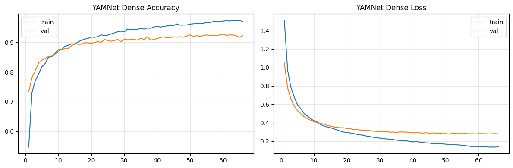

# MotoSense — Sistem Klasifikasi Audio Kerusakan Mesin Sepeda Motor

<p align="center">
  
  
  
  
</p>

## 📋 Deskripsi Proyek

**MotoSense** adalah sistem klasifikasi audio berbasis deep learning yang dirancang untuk mendeteksi dan mengklasifikasikan berbagai jenis kerusakan pada mesin sepeda motor melalui analisis suara. Proyek ini menggunakan **YAMNet** (Yet Another Mobile Network) dari TensorFlow Hub sebagai feature extractor, dikombinasikan dengan classifier seperti **Sequential Neural Network (Dense)**, **Support Vector Machine (SVM)**, dan **Random Forest**.

### 🎯 Tujuan
- Mendeteksi kerusakan mesin sepeda motor secara otomatis melalui audio
- Mengklasifikasikan 8 jenis kerusakan komponen mesin
- Menyediakan model yang dapat diimplementasikan pada perangkat mobile (TFLite)

---

## 🔧 Jenis Kerusakan yang Dapat Dideteksi

Sistem ini dapat mengidentifikasi **8 kategori kerusakan** pada komponen mesin:

| No | Kelas | Komponen |
|----|-------|----------|
| 1 | **Clutch-Shoe** | Kampas kopling |
| 2 | **Connecting-Rod** | Stang seher |
| 3 | **Drive-Belt** | Van belt / sabuk CVT |
| 4 | **Piston** | Piston |
| 5 | **Tensioner** | Tensioner |
| 6 | **Slider** | Slider CVT |
| 7 | **Roller** | Roller CVT |
| 8 | **Face-Drive** | Face pulley / drive face |

---

## 🏗️ Arsitektur Sistem

### Model Pipeline
```
Audio Input (WAV/MP3/M4A)
    ↓
Preprocessing (16kHz, 2s duration)
    ↓
YAMNet Feature Extraction (1024-dim embeddings)
    ↓
Classifier (Sequential / SVM / Random Forest)
    ↓
Predicted Class + Confidence Score
```

### Teknologi Utama
- **YAMNet**: Pre-trained audio event detection model dari Google
- **TensorFlow/Keras**: Deep learning framework
- **Librosa**: Audio processing dan feature extraction
- **Audiomentations**: Data augmentation untuk audio
- **Scikit-learn**: Machine learning classifiers (SVM, Random Forest)

---

## 📊 Hasil Training & Performa Model

Tiga eksperimen dilakukan dengan perbedaan pada strategi augmentasi dan pemisahan dataset:

### ✅ Eksperimen 1: YAMNet + Aug-Split *(Terbaik)*
> **Augmentasi dilakukan sebelum split** → dataset lebih besar & merata

| Model | Val Accuracy | **Test Accuracy** | Precision | Recall | F1 Score |
|-------|:------------:|:-----------------:|:---------:|:------:|:--------:|
| 🥇 **Sequential (Dense)** | — | **93.00%** | 93.07% | 93.00% | 93.01% |
| 🥈 **Random Forest** | 90.38% | **92.75%** | 92.83% | 92.75% | 92.75% |
| 🥉 **SVM** | 91.50% | **90.62%** | 91.38% | 90.62% | 90.80% |

### Eksperimen 2: YAMNet + Split-Aug
> **Augmentasi dilakukan setelah split** → data test lebih bersih, tapi lebih sedikit

| Model | Val Accuracy | **Test Accuracy** | Precision | Recall | F1 Score |
|-------|:------------:|:-----------------:|:---------:|:------:|:--------:|
| **Sequential (Dense)** | — | 79.17% | 80.21% | 79.17% | 76.81% |
| **SVM** | 89.47% | 83.33% | 79.63% | 83.33% | 78.44% |
| **Random Forest** | 89.47% | 83.33% | 80.14% | 83.33% | 78.60% |

### Eksperimen 3: Tanpa YAMNet (CNN only)
> **Menggunakan CNN langsung tanpa pre-trained YAMNet** sebagai baseline

| Model | Val Accuracy | **Test Accuracy** | Precision | Recall | F1 Score |
|-------|:------------:|:-----------------:|:---------:|:------:|:--------:|
| **Sequential (Dense)** | — | 75.00% | 72.00% | 75.00% | 70.00% |
| **SVM** | 78.95% | 79.17% | 68.66% | 79.17% | 72.84% |
| **Random Forest** | 89.47% | 83.33% | 80.14% | 83.33% | 78.60% |

---

### 📈 Perbandingan Akurasi Semua Model

```
Eksperimen 1 — YAMNet + Aug-Split (Best Setup)
┌─────────────────────────────────────────────────────────┐
│  Sequential   ████████████████████████████████  93.00% │
│  Random Forest████████████████████████████████  92.75% │
│  SVM          ██████████████████████████████░░  90.62% │
└─────────────────────────────────────────────────────────┘

Eksperimen 2 — YAMNet + Split-Aug
┌─────────────────────────────────────────────────────────┐
│  Sequential   █████████████████████████░░░░░░░  79.17% │
│  SVM          ██████████████████████████░░░░░░  83.33% │
│  Random Forest██████████████████████████░░░░░░  83.33% │
└─────────────────────────────────────────────────────────┘

Eksperimen 3 — Tanpa YAMNet (Baseline)
┌─────────────────────────────────────────────────────────┐
│  Sequential   ████████████████████████░░░░░░░░  75.00% │
│  SVM          █████████████████████████░░░░░░░  79.17% │
│  Random Forest██████████████████████████░░░░░░  83.33% │
└─────────────────────────────────────────────────────────┘
```

---

### 📉 Kurva Training — Sequential (YAMNet + Aug-Split)



Model berhasil konvergen dengan baik:
- **Train Accuracy** mencapai ~96% di akhir training
- **Val Accuracy** stabil di ~92–93%
- **Loss** turun konsisten tanpa overfitting signifikan

---

### 🔥 Confusion Matrix — YAMNet + Aug-Split

#### Sequential Neural Network (93.00% Test Accuracy)


**Classification Report — Sequential:**
```
               precision    recall  f1-score   support

  Clutch-Shoe       0.95      0.90      0.92       100
Conecting-Rod       0.98      0.96      0.97       100
   Drive-Belt       0.98      0.95      0.96       100
       Piston       0.93      0.97      0.95       100
    Tensioner       0.93      0.93      0.93       100
       Slider       0.91      0.95      0.93       100
       Roller       0.91      0.90      0.90       100
   Face-Drive       0.85      0.88      0.87       100

     accuracy                           0.93       800
    macro avg       0.93      0.93      0.93       800
 weighted avg       0.93      0.93      0.93       800
```

#### Support Vector Machine (90.62% Test Accuracy)


**Classification Report — SVM:**
```
               precision    recall  f1-score   support

  Clutch-Shoe       0.73      0.92      0.81       100
Conecting-Rod       0.99      0.86      0.92       100
   Drive-Belt       0.93      0.90      0.91       100
       Piston       0.99      0.97      0.98       100
    Tensioner       0.91      0.91      0.91       100
       Slider       0.93      0.89      0.91       100
       Roller       0.93      0.91      0.92       100
   Face-Drive       0.91      0.89      0.90       100

     accuracy                           0.91       800
    macro avg       0.91      0.91      0.91       800
 weighted avg       0.91      0.91      0.91       800
```

#### Random Forest (92.75% Test Accuracy)


**Classification Report — Random Forest:**
```
               precision    recall  f1-score   support

  Clutch-Shoe       0.97      0.88      0.92       100
Conecting-Rod       0.99      0.97      0.98       100
   Drive-Belt       0.93      0.96      0.95       100
       Piston       0.93      0.95      0.94       100
    Tensioner       0.92      0.93      0.93       100
       Slider       0.91      0.93      0.92       100
       Roller       0.89      0.91      0.90       100
   Face-Drive       0.88      0.89      0.89       100

     accuracy                           0.93       800
    macro avg       0.93      0.93      0.93       800
 weighted avg       0.93      0.93      0.93       800
```

---

### 📌 Kesimpulan Eksperimen

| Aspek | Temuan |
|-------|--------|
| **Strategi terbaik** | Augmentasi sebelum split (Aug-Split) menghasilkan akurasi lebih tinggi |
| **Model terbaik** | YAMNet + Sequential (Dense) dengan **93.00%** test accuracy |
| **Kontribusi YAMNet** | Transfer learning YAMNet meningkatkan akurasi ~10–15% dibanding CNN tanpa YAMNet |
| **Kelas tersulit** | `Face-Drive` dan `Clutch-Shoe` memiliki F1-score terendah di semua model |
| **Kelas termudah** | `Connecting-Rod` dan `Piston` konsisten mencapai F1-score ≥ 0.97 |

---

## 📦 Instalasi

### Prerequisites
- Python 3.8 atau lebih tinggi
- pip (Python package manager)
- ffmpeg (untuk audio processing)

### Langkah Instalasi

1. **Clone Repository**
```bash
git clone https://github.com/motosense/model-ai.git
cd model-ai
```

2. **Install Dependencies**
```bash
pip install -r requirements.txt
```

Atau install secara manual:
```bash
pip install tensorflow tensorflow-hub
pip install librosa soundfile
pip install audiomentations
pip install scikit-learn
pip install pandas numpy matplotlib seaborn
pip install jupyter ipywidgets
```

3. **Install FFmpeg** (jika belum terinstall)
- **macOS**: `brew install ffmpeg`
- **Ubuntu/Debian**: `sudo apt-get install ffmpeg`
- **Windows**: Download dari [ffmpeg.org](https://ffmpeg.org/download.html)

---

## 📂 Struktur Dataset

```
dataset/
├── part-rusak/              # Dataset audio mentah
│   ├── Clutch-Shoe/
│   ├── Conecting-Rod/
│   ├── Drive-Belt/
│   ├── Piston/
│   ├── Tensioner/
│   ├── Slider/
│   ├── Roller/
│   └── Face-Drive/
├── rename/                  # File audio yang sudah direname
├── preprocessed/            # Audio setelah preprocessing
├── augmented/               # Audio hasil augmentasi (target: 1000 file/kelas)
└── split/                   # Dataset split (train/validation/test)
    ├── train/
    ├── validation/
    └── test/
```

---

## 🚀 Cara Menggunakan

### 1. Persiapan Data

Letakkan file audio kerusakan mesin di folder `dataset/part-rusak/` sesuai dengan kategori masing-masing.

### 2. Training Model

Buka dan jalankan notebook sesuai kebutuhan:

#### a. **YAMNet + Sequential Neural Network** *(Direkomendasikan)*
```bash
jupyter notebook "YAMNet aug-split/YAMNET + SVM + RF/MotoSense_YAMNet.ipynb"
```

### 3. Pipeline Training

Notebook akan menjalankan pipeline berikut:

1. **Rename Files**: Standarisasi penamaan file
2. **Exploratory Data Analysis (EDA)**: Analisis durasi, sample rate
3. **Preprocessing**:
   - Resample ke 16kHz
   - Segmentasi audio (2 detik dengan overlap)
   - Normalisasi
4. **Data Augmentation**:
   - Gaussian Noise
   - Pitch Shift
   - Time Stretch
   - Low/Band Pass Filter
   - Clipping Distortion
5. **Feature Extraction**: YAMNet embeddings (1024 dimensi)
6. **Model Training**: Sequential NN / SVM / Random Forest
7. **Evaluation**: Classification report, confusion matrix
8. **Export**: Model TFLite untuk deployment mobile

### 4. Inferensi

Gunakan widget interaktif di notebook untuk melakukan prediksi:

```python
# Upload audio file melalui widget
# Model akan otomatis melakukan prediksi dan menampilkan hasil
```

---

## 📊 Preprocessing & Augmentasi

### Parameter Preprocessing
```python
TARGET_SR = 16000           # Sample rate YAMNet
DURATION = 2                # Durasi segmen (detik)
TARGET_SAMPLES = 32000      # 16000 * 2
STRIDE_SAMPLES = 24000      # Overlap 1.5 detik
```

### Teknik Augmentasi
- **AddGaussianNoise**: Menambah noise gaussian (SNR: 5–15 dB)
- **PitchShift**: Mengubah pitch (−3 hingga +3 semitones)
- **TimeStretch**: Mempercepat/memperlambat (0.8x–1.2x)
- **LowPassFilter**: Filter frekuensi tinggi (2000–7000 Hz)
- **BandPassFilter**: Filter pita frekuensi
- **ClippingDistortion**: Menambah distorsi
- **Gain**: Mengubah volume (−12 hingga +12 dB)

**Target**: 1000 sampel per kelas (8000 total)

---

## 🎯 Konfigurasi Model

### Sequential Neural Network (Dense)
```python
Model: Sequential
- Input: YAMNet Embeddings (1024 dim)
- Dense Layer 1: 512 units, ReLU, Dropout(0.3)
- Dense Layer 2: 256 units, ReLU, Dropout(0.3)
- Dense Layer 3: 128 units, ReLU, Dropout(0.2)
- Output: 8 units (softmax)

Optimizer: Adam (lr=1e-4)
Loss: Categorical Crossentropy
Batch Size: 8
Epochs: 100 (with EarlyStopping + ReduceLROnPlateau)
```

### Support Vector Machine (SVM)
```python
Kernel: RBF
Class Weight: Balanced
Pre-processing: StandardScaler
```

### Random Forest
```python
n_estimators: 100–200
max_depth: Tuned via GridSearchCV
Class Weight: Balanced
```

---

## 📱 Export ke TensorFlow Lite

Model dapat dikonversi ke TFLite untuk deployment mobile:

```python
# Conversion sudah tersedia di notebook
# Output: yamnet_sequential.tflite
```

File model tersimpan di:
```
models/sequential/tflite/yamnet_sequential.tflite
```

---

## 🔬 Exploratory Data Analysis (EDA)

Dataset asli memiliki karakteristik:

| Kelas | Jumlah File | Sample Rate | Durasi Rata-rata | Min | Max |
|-------|:-----------:|:-----------:|:----------------:|:---:|:---:|
| Clutch-Shoe | 15 | 44100 Hz | 2.51s | 1.07s | 4.08s |
| Connecting-Rod | 10 | 44100 Hz | 2.37s | 1.62s | 4.21s |
| Drive-Belt | 20 | 44100 Hz | 3.55s | 1.60s | 6.75s |
| Piston | 6 | 44100 Hz | 1.74s | 1.00s | 3.17s |
| Tensioner | 8 | 44100 Hz | 2.97s | 1.59s | 7.41s |
| Slider | 13 | 44100 Hz | 3.91s | 0.84s | 6.51s |
| Roller | 19 | 44100 Hz | 3.78s | 1.53s | 9.15s |
| Face-Drive | 9 | 44100 Hz | 3.14s | 1.20s | 4.82s |

**Setelah augmentasi**: 1000 sampel per kelas = **8.000 total sampel**

---

## 🗂️ Struktur Repository

```
├── YAMNet aug-split/                    # Eksperimen: Aug sebelum Split ✅
│   └── YAMNET + SVM + RF/
│       ├── MotoSense_YAMNet.ipynb       # Notebook utama
│       ├── dataset/                      # Dataset
│       └── models/                       # Model yang tersimpan
│           ├── sequential/               # Sequential NN
│           │   ├── keras/               # Format .keras
│           │   └── tflite/              # Format .tflite
│           ├── svm/                     # SVM model (joblib)
│           └── random_forest/           # Random Forest model
├── YAMNet split-aug/                    # Eksperimen: Split sebelum Aug
│   └── YAMNET + SVM + RF/
│       └── MotoSense_YAMNet.ipynb
├── without YAMNet/                      # Eksperimen: CNN tanpa YAMNet
│   └── MotoSense_CNN_NoYAMNet.ipynb
├── helper/
│   └── kalsisfikasi_audio.ipynb         # Notebook helper/alternatif
├── api/                                 # REST API deployment
├── assets/                              # Gambar & visualisasi
├── README.md                            # Dokumentasi ini
└── requirements.txt                     # Dependencies
```

---

## 🛠️ Troubleshooting

### Issue: FFmpeg tidak ditemukan
**Solusi**: Install ffmpeg sesuai OS Anda (lihat bagian Instalasi)

### Issue: Out of Memory saat training
**Solusi**:
- Kurangi `BATCH_SIZE`
- Gunakan GPU jika tersedia
- Reduce augmentation target

### Issue: Model overfitting
**Solusi**:
- Tambah Dropout layers
- Augmentasi lebih agresif
- Kurangi kompleksitas model

---

## 📚 Referensi

1. **YAMNet**: [TensorFlow Hub - YAMNet](https://tfhub.dev/google/yamnet/1)
2. **Audiomentations**: [GitHub - iver56/audiomentations](https://github.com/iver56/audiomentations)
3. **Librosa**: [librosa.org](https://librosa.org/)
4. Paper: *"Transfer Learning for Audio Classification using YAMNet"*

---

## 👥 Tim Pengembang

**Capstone Project — Pijak IBM 2026**

---

## 📄 Lisensi

[MIT License]

---

## 🙏 Acknowledgments

- Google Research untuk YAMNet pre-trained model
- TensorFlow Team
- IBM Capstone Program

---

## 📞 Kontak

Untuk pertanyaan atau saran, silakan buat issue di repository ini.

---

**Happy Coding! 🚀**
